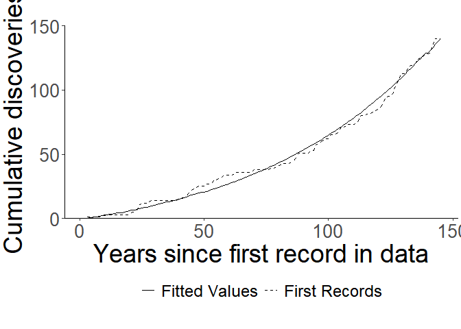

<!-- README.md is generated from README.Rmd. Please edit that file -->

# alien: an R package for estimating alien introduction rates

<!-- badges: start -->
<!-- badges: end -->

alien is a package dedicated to easily estimate the introduction rates
of alien species given first records data. It specializes in addressing
the role of sampling on the pattern of discoveries, thus providing
better estimates than using Generalized Linear Models which assume
perfect immediate detection of newly introduced species.

## Installation

You can install the CRAN version of the package with:

``` r
install.packages("alien")
```

You can install the development version of alien from
[GitHub](https://github.com/) with:

``` r
# install.packages("devtools")
devtools::install_github("hezibu/alien")
```

## Basic Usage

For the most basic demonstration, let’s look at the data provided in
Solow and Costello (2004) which describes discoveries of introduced
species in the San Francisco estuary (California, USA) between the years
1850–1995. We’ll plot it in a cumulative form, replicating the plot from
Solow and Costello (2004):

``` r
library(alien)
library(ggplot2)

data("sfestuary")
years <- seq_along(sfestuary) + 1850

ggplot()+
  aes(x = years, y = cumsum(sfestuary))+
  geom_line() + 
  coord_cartesian(ylim = c(0,150))+
  scale_x_continuous(expand = c(0,0), breaks = seq(1860, 1980, 20)) + 
  scale_y_continuous(expand = c(0,0), breaks = seq(0, 150, 50)) + 
  ylab("Cumulative discoveries") + theme(axis.title.x = element_blank())
```


### Model Fitting

As described thoroughly, these discoveries also entail trends in the
probability of detecting new alien species. To estimate the introduction
rate, ${\beta_1}$, from these data, we will fit the Solow and Costello
model using the `snc` function. We can use the `control` argument to
pass a list of options to `optim` which does the Maximum-Likelihood
Estimation[^1]:

``` r
model <- snc(y = sfestuary, control = list(maxit = 1e4))
#> ! no data supplied, using time as independent variable
```

When only a vector describing discoveries is supplied, `snc` warns users
that it uses the time as the independent variable, similar to the
original S&C model.

The result is a list containing several objects:

``` r
names(model)
#> [1] "records"        "convergence"    "log-likelihood" "coefficients"  
#> [5] "type"           "fitted.values"  "predict"
```

We’ll go over each.

#### Records

Shows the supplied records data.

``` r
model$records
#>   [1] 0 0 1 0 0 0 0 0 1 1 0 0 0 0 0 0 0 0 0 0 2 0 1 5 1 0 0 1 1 0 0 0 0 0 0 0 0
#>  [38] 0 0 1 1 0 2 2 2 1 1 1 0 0 2 0 0 3 0 1 1 2 0 0 0 1 1 0 0 0 0 0 0 2 0 0 0 0
#>  [75] 0 0 1 0 1 1 1 1 0 0 1 1 2 4 0 0 0 0 2 0 4 2 1 1 1 0 3 0 1 1 4 0 1 1 0 0 1
#> [112] 2 4 0 1 1 0 1 1 1 2 3 4 1 0 3 5 4 5 1 0 4 2 0 1 4 1 1 2 0 1 7 4 0 0
```

#### Convergence

Did the optimation algorithm converge? This prints out the convergence
code from `optim`:

``` r
model$convergence
#> [1] 0
```

| Code | Meaning/Troubleshooting                                                                                              |
|------|----------------------------------------------------------------------------------------------------------------------|
| 0    | Successful convergence                                                                                               |
| 1    | Iteration limit `maxit` had been reached (increase `maxit` using `control = list(maxit = number))`                   |
| 10   | Degeneracy of the Nelder-Mead simplex                                                                                |
| 51   | Warning from the `"L-BFGS-B"`method; Use `debug(snc)` and check the `optim` component `message` for further details. |
| 52   | Error from the `"L-BFGS-B"`method; Use `debug(snc)` and check the `optim` component `message` for further details.   |

#### log-likelihood

The log-likelihood at the end point of the algorithm (preferably at
convergence). Can be used for model selection if needed:

``` r
model$`log-likelihood`
#> [1] 118.7776
```

#### coefficients

The parameter estimates.

- `beta0` signifies ${\beta_0}$ - the intercept for ${\mu}$.
- `gamma0` signifies ${\gamma_0}$ - the intercept for ${\Pi}$.
- `gamma2` signifies ${\gamma_2}$ - and will only appear when the `snc`
  argument `growth` is set to `TRUE` (the default).

``` r
model$coefficients
#>             Estimate      Std.Err
#> beta0    -1.12739745     1.835403
#> beta1     0.01401579     1.835403
#> gamma0 -185.89484996 15630.676343
#> gamma1  -79.80040427  7235.922667
#> gamma2   76.23985293  6339.859143
```

#### predict

The fitted ${\lambda_t}$ values of the model. The mean of the Poisson
distribution from which the records are assumed to derive.

``` r
model$predict
#>          mean      lower_95     higher_95
#> 1   0.3284464  2.464968e-04  4.376407e+02
#> 2   0.3330822  6.848124e-06  1.620061e+04
#> 3   0.3377835  1.902532e-07  5.997150e+05
#> 4   0.3425512  5.285577e-09  2.220028e+07
#> 5   0.3473861  1.468428e-10  8.218113e+08
#> 6   0.3522893  4.079558e-12  3.042185e+10
#> 7   0.3572616  1.133375e-13  1.126158e+12
#> 8   0.3623042  3.148719e-15  4.168817e+13
#> 9   0.3674179  8.747707e-17  1.543215e+15
#> 10  0.3726038  2.430270e-18  5.712682e+16
#> 11  0.3778629  6.751728e-20  2.114724e+18
#> 12  0.3831963  1.875752e-21  7.828296e+19
#> 13  0.3886049  5.211175e-23  2.897883e+21
#> 14  0.3940898  1.447758e-24  1.072740e+23
#> 15  0.3996522  4.022133e-26  3.971074e+24
#> 16  0.4052931  1.117421e-27  1.470014e+26
#> 17  0.4110136  3.104396e-29  5.441708e+27
#> 18  0.4168148  8.624572e-31  2.014414e+29
#> 19  0.4226980  2.396061e-32  7.456970e+30
#> 20  0.4286641  6.656689e-34  2.760425e+32
#> 21  0.4347145  1.849348e-35  1.021856e+34
#> 22  0.4408502  5.137821e-37  3.782711e+35
#> 23  0.4470726  1.427379e-38  1.400286e+37
#> 24  0.4533828  3.965516e-40  5.183587e+38
#> 25  0.4597821  1.101692e-41  1.918863e+40
#> 26  0.4662716  3.060698e-43  7.103257e+41
#> 27  0.4728528  8.503170e-45  2.629488e+43
#> 28  0.4795269  2.362334e-46  9.733852e+44
#> 29  0.4862952  6.562988e-48  3.603283e+46
#> 30  0.4931590  1.823316e-49  1.333865e+48
#> 31  0.5001196  5.065500e-51  4.937709e+49
#> 32  0.5071786  1.407287e-52  1.827844e+51
#> 33  0.5143371  3.909697e-54  6.766323e+52
#> 34  0.5215967  1.086184e-55  2.504761e+54
#> 35  0.5289588  3.017615e-57  9.272138e+55
#> 36  0.5364248  8.383477e-59  3.432365e+57
#> 37  0.5439961  2.329081e-60  1.270595e+59
#> 38  0.5516743  6.470605e-62  4.703495e+60
#> 39  0.5594609  1.797651e-63  1.741142e+62
#> 40  0.5673574  4.994197e-65  6.445370e+63
#> 41  0.5753654  1.387478e-66  2.385951e+65
#> 42  0.5834864  3.854663e-68  8.832325e+66
#> 43  0.5917220  1.070895e-69  3.269555e+68
#> 44  0.6000738  2.975138e-71  1.210326e+70
#> 45  0.6085435  8.265468e-73  4.480390e+71
#> 46  0.6171328  2.296296e-74  1.658553e+73
#> 47  0.6258433  6.379523e-76  6.139641e+74
#> 48  0.6346767  1.772346e-77  2.272776e+76
#> 49  0.6436349  4.923897e-79  8.413374e+77
#> 50  0.6527194  1.367947e-80  3.114467e+79
#> 51  0.6619322  3.800403e-82  1.152915e+81
#> 52  0.6712751  1.055820e-83  4.267868e+82
#> 53  0.6807498  2.933259e-85  1.579882e+84
#> 54  0.6903582  8.149121e-87  5.848415e+85
#> 55  0.7001022  2.263973e-88  2.164969e+87
#> 56  0.7099838  6.289723e-90  8.014295e+88
#> 57  0.7200048  1.747398e-91  2.966736e+90
#> 58  0.7301673  4.854587e-93  1.098228e+92
#> 59  0.7404733  1.348692e-94  4.065427e+93
#> 60  0.7509246  3.746908e-96  1.504942e+95
#> 61  0.7615235  1.040958e-97  5.571002e+96
#> 62  0.7722721  2.891970e-99  2.062277e+98
#> 63  0.7831723 8.034412e-101  7.634147e+99
#> 64  0.7942263 2.232104e-102 2.826013e+101
#> 65  0.8054364 6.201187e-104 1.046135e+103
#> 66  0.8168047 1.722801e-105 3.872588e+104
#> 67  0.8283335 4.786252e-107 1.433557e+106
#> 68  0.8400250 1.329707e-108 5.306748e+107
#> 69  0.8518815 3.694165e-110 1.964455e+109
#> 70  0.8639054 1.026306e-111 7.272030e+110
#> 71  0.8760989 2.851262e-113 2.691964e+112
#> 72  0.8884646 7.921317e-115 9.965127e+113
#> 73  0.9010048 2.200685e-116 3.688896e+115
#> 74  0.9137220 6.113898e-118 1.365558e+117
#> 75  0.9266187 1.698551e-119 5.055029e+118
#> 76  0.9396975 4.718880e-121 1.871273e+120
#> 77  0.9529608 1.310990e-122 6.927089e+121
#> 78  0.9664113 3.642165e-124 2.564274e+123
#> 79  0.9800517 1.011859e-125 9.492443e+124
#> 80  0.9938846 2.811126e-127 3.513918e+126
#> 81  1.0079128 7.809815e-129 1.300784e+128
#> 82  1.0221389 2.169707e-130 4.815249e+129
#> 83  1.0365659 6.027837e-132 1.782512e+131
#> 84  1.0511965 1.674641e-133 6.598511e+132
#> 85  1.0660336 4.652455e-135 2.442640e+134
#> 86  1.0810801 1.292536e-136 9.042180e+135
#> 87  1.0963389 3.590897e-138 3.347239e+137
#> 88  1.1118132 9.976158e-140 1.239083e+139
#> 89  1.1275058 2.771556e-141 4.586843e+140
#> 90  1.1434200 7.699882e-143 1.697960e+142
#> 91  1.1595588 2.139166e-144 6.285518e+143
#> 92  1.1759253 5.942987e-146 2.326777e+145
#> 93  1.1925229 1.651069e-147 8.613275e+146
#> 94  1.2093547 4.586966e-149 3.188467e+148
#> 95  1.2264241 1.274342e-150 1.180308e+150
#> 96  1.2437344 3.540350e-152 4.369272e+151
#> 97  1.2612891 9.835731e-154 1.617419e+153
#> 98  1.2790915 2.732543e-155 5.987372e+154
#> 99  1.2971452 7.591496e-157 2.216409e+156
#> 100 1.3154538 2.109054e-158 8.204714e+157
#> 101 1.3340207 5.859332e-160 3.037225e+159
#> 102 1.3528497 1.627828e-161 1.124322e+161
#> 103 1.3719445 4.522399e-163 4.162021e+162
#> 104 1.3913087 1.256404e-164 1.540699e+164
#> 105 1.4109463 3.490516e-166 5.703368e+165
#> 106 1.4308611 9.697280e-168 2.111276e+167
#> 107 1.4510569 2.694079e-169 7.815533e+168
#> 108 1.4715378 7.484636e-171 2.893158e+170
#> 109 1.4923078 2.079367e-172 1.070991e+172
#> 110 1.5133710 5.776854e-174 3.964600e+173
#> 111 1.5347314 1.604914e-175 1.467618e+175
#> 112 1.5563933 4.458740e-177 5.432836e+176
#> 113 1.5783610 1.238718e-178 2.011130e+178
#> 114 1.6006387 3.441382e-180 7.444812e+179
#> 115 1.6232309 9.560779e-182 2.755925e+181
#> 116 1.6461419 2.656156e-183 1.020190e+183
#> 117 1.6693764 7.379280e-185 3.776544e+184
#> 118 1.6929387 2.050097e-186 1.398003e+186
#> 119 1.7168337 5.695538e-188 5.175135e+187
#> 120 1.7410659 1.582323e-189 1.915734e+189
#> 121 1.7656401 4.395978e-191 7.091676e+190
#> 122 1.7905612 1.221282e-192 2.625201e+192
#> 123 1.8158340 3.392940e-194 9.717982e+193
#> 124 1.8414635 9.426198e-196 3.597408e+195
#> 125 1.8674548 2.618767e-197 1.331690e+197
#> 126 1.8938130 7.275407e-199 4.929659e+198
#> 127 1.9205431 2.021239e-200 1.824864e+200
#> 128 1.9476506 5.615366e-202 6.755291e+201
#> 129 1.9751407 1.560050e-203 2.500677e+203
#> 130 2.0030187 4.334099e-205 9.257021e+204
#> 131 2.0312903 1.204091e-206 3.426769e+206
#> 132 2.0599609 3.345180e-208 1.268523e+208
#> 133 2.0890361 9.293513e-210 4.695826e+209
#> 134 2.1185218 2.581905e-211 1.738304e+211
#> 135 2.1484236 7.172997e-213 6.434861e+212
#> 136 2.1787475 1.992788e-214 2.382061e+214
#> 137 2.2094993 5.536322e-216 8.817925e+215
#> 138 2.2406853 1.538090e-217 3.264224e+217
#> 139 2.2723113 4.273091e-219 1.208352e+219
#> 140 2.3043838 1.187141e-220 4.473085e+220
#> 141 2.3369090 3.298093e-222 1.655849e+222
#> 142 2.3698932 9.162694e-224 6.129631e+223
#> 143 2.4033430 2.545561e-225 2.269070e+225
#> 144 2.4372649 7.072028e-227 8.399657e+226
#> 145 2.4716656 1.964736e-228 3.109390e+228
```

### Plotting

Once we’ve fitted the model, we can use its fit to easily plot
${\lambda_t}$ along with the first records using the function
`plot_snc`. Users can choose either `annual` or `cumulative` plots.
Because the output is a `ggplot` object, it can easily be customized
further:

``` r

plot_snc(model, cumulative = T) +
  coord_cartesian(ylim = c(0,150))+
  scale_y_continuous(expand = c(0,0), breaks = seq(0, 150, 50)) + 
  ylab("Cumulative discoveries") + 
  xlab("Years since first record in data") + 
  theme(axis.title.x = element_blank())
```



[^1]: In this case we increase `maxiter` so the algorithm will converge
